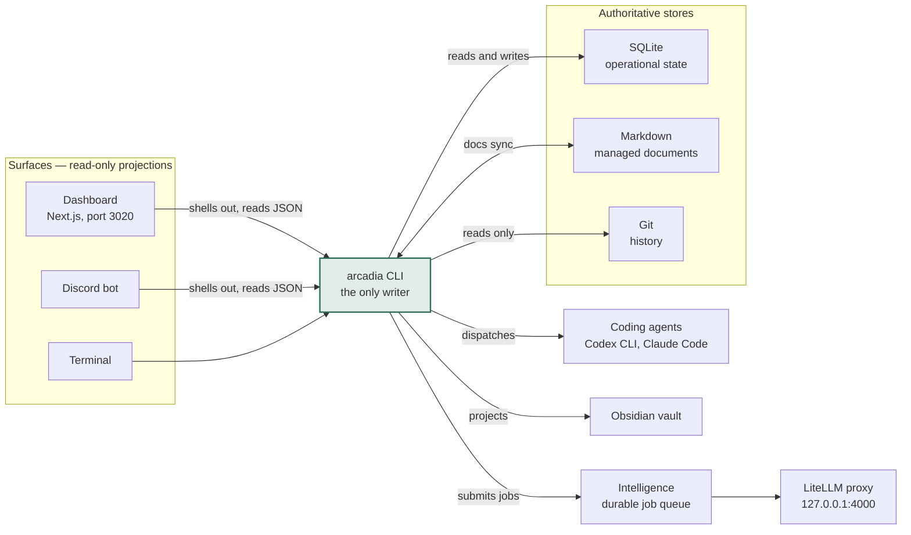
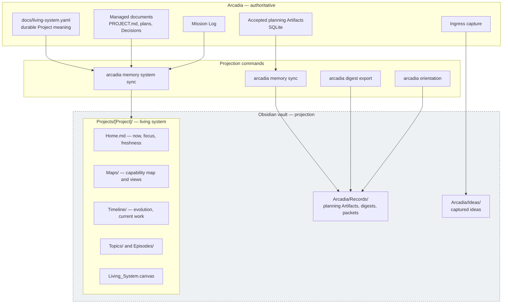
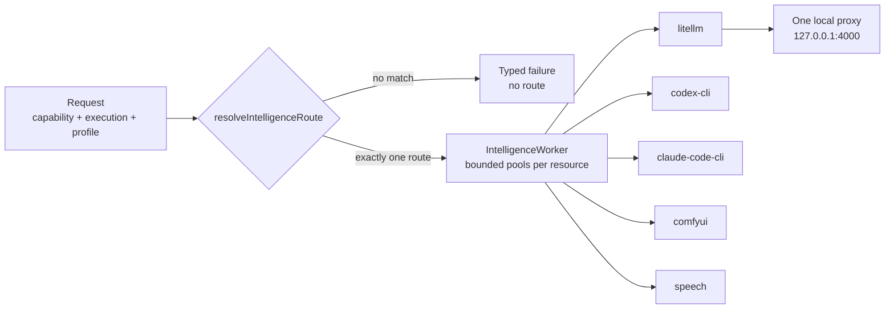

# Arcadia Architecture

High-level shape of the system, in Mermaid so it renders wherever the Markdown
goes — GitHub, Obsidian, a plain reader — and so changing it is a text edit
rather than redrawing a picture.

This is deliberately *high level*: enough to explain the system to someone
seeing it for the first time, not a component inventory. For the non-obvious
implementation facts an agent needs before touching the database, the
Intelligence service, or the Discord bot, read
[`AGENT_ORIENTATION.md`](AGENT_ORIENTATION.md), which this document summarizes
rather than replaces.

## The shape

One writer, three stores, and a set of surfaces that can only ask it questions.



The claim worth stating out loud, because it is the thing a diagram cannot
draw: **no surface ever opens the database.** The dashboard and the Discord bot
run the same CLI as a subprocess and read its JSON, which is why the terminal
and the phone can never disagree, and why adding a surface costs one adapter
and grants it no new powers.

## Where each fact lives

Each fact has exactly one authoritative home. When two of these disagree, the
one named here wins *for that kind of fact*.

| Store | Authoritative for |
| --- | --- |
| SQLite | Operational state — queues, Actions, Runs, Intelligence jobs. Lives in the workspace, outside this repository. |
| Markdown | What the work *is* — `PROJECT.md`, plans, Decisions, Mission Log. Checked-in managed documentation beats the database. |
| Git | History. Never infer current priority from commit order; that is the pointer chain's job. |

## The Obsidian memory projection

The vault is a **projection, not a second status store**. Nothing in it is
authoritative, generated pages are replaceable, and rollback means deleting the
generated subtree and running sync again. Never hand-edit a generated page.



Two guards are enforced rather than assumed: the configured path must be a real
vault (`.obsidian/` present), and the vault and the operational workspace must
not contain one another — a vault nested in the workspace would make the
projection look like a source.

Preview any projection before it writes:

```bash
pnpm arcadia memory system sync --project arcadia
```

Add `--apply` to write. Every page is ordinary Markdown, so headings and lists
open as Markmap panes and WikiLinks work in Reading View; the Canvas split is a
convenience, never the authority, and routine sync never installs a plugin.

## Intelligence routing

Routing is a **deterministic lookup, not a policy engine**. A request resolves
to exactly one route or to a typed failure — there is no automatic fallback,
escalation, or model selection, and `local-preferred` never silently becomes a
cloud call.



Jobs are durable and idempotent: keyed by `idempotency_key`, moving
`queued → running → completed | failed | blocked`, with one retry. There is no
cancellation. The HTTP API is unauthenticated on purpose — Arcadia is
local-first and single-operator, and "source" is a label, not a principal.

## Keeping this true

Nothing here is generated, so it will drift unless it is edited alongside the
change that invalidates it. That is the deliberate trade: a hand-written
diagram costs a minute when the architecture moves, and a generated one costs a
generator to build and maintain. Revisit that choice when a second person needs
these diagrams to be current without asking anyone.

Private Practice Now's equivalent lives in that repository at
`docs/architecture.md`.
