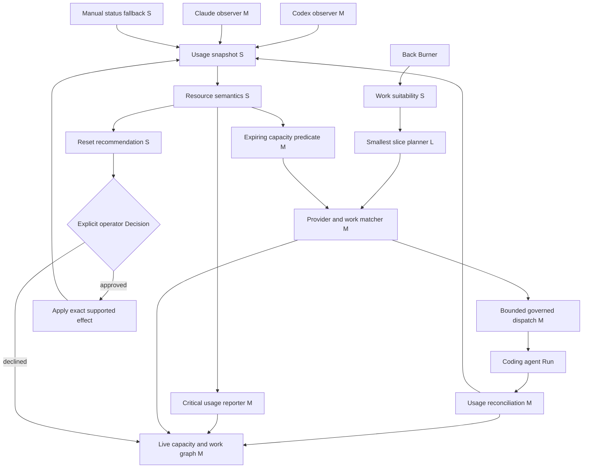

# Provider capacity harvesting

## Outcome

Arcadia treats otherwise-expiring included coding-agent allowance as a scarce,
perishable planning signal. When higher-priority governed work cannot use that
allowance, Arcadia may select the smallest safe Back Burner slice, show why it
fits, and advance it through the existing governed Run path. It never turns a
quota opportunity into spending or execution authority.

This plan extends the deferred `budget-aware-admission` Action in
`docs/plans/agent-advance-queue.md`. It is proposed rather than active because
the operator classified the capability as ideal Back Burner work. It becomes a
candidate for activation when the operator selects it or when a reliably
capturable provider usage receipt makes the first observer slice worthwhile;
neither condition changes `PROJECT.md` without an explicit pointer transition.

## The vital few

1. Establish an honest usage receipt that admits unknowns.
2. Observe provider allowance without buying, redeeming, or guessing.
3. Fire one deterministic opportunity predicate.
4. Match it to the smallest already-governed safe slice.
5. Reconcile the result so the next estimate improves.

The expensive tail is cross-provider precision. It is not worth delaying the
first useful slice: one provider plus a manual/status receipt can prove the
entire policy before a second machine-readable provider interface exists.

## T-shirt estimates

| Module | Size | Delivery slice |
| --- | --- | --- |
| Usage snapshot contract | S | `define-provider-usage-snapshot` |
| Codex usage observer | M | `observe-codex-capacity` |
| Claude Code usage observer | M | `observe-claude-capacity` |
| Manual/status fallback | S | Shared by both observer Actions |
| Resource semantics | S | `define-provider-usage-snapshot` |
| Critical-usage reporter | M | `report-critical-provider-usage` |
| Capacity opportunity predicate | M | `fire-expiring-capacity-predicate` |
| Work suitability metadata | S | `shape-smallest-back-burner-slice` |
| Smallest-slice planner | L | `shape-smallest-back-burner-slice` |
| Admission and provider matcher | M | `admit-bounded-spare-capacity-run` |
| Bounded dispatcher integration | M | `admit-bounded-spare-capacity-run` |
| Usage reconciliation | M | `reconcile-and-graph-capacity-use` |
| Live capacity/work graph | M | `reconcile-and-graph-capacity-use` |
| Reset and credit Decision boundary | S | `guard-reset-and-credit-effects` |

Sizes mean XS is hours, S is one to three focused days, M is three to seven
focused days, L is one to two weeks, and XL is multi-week. They are complexity
estimates, not schedules. Reusing Back Burner, managed-plan readiness, execution
profiles, token budgets, provider gates, Runs, leases, and receipts makes the
first useful single-provider loop approximately L overall. Trustworthy dual-
provider observation, reconciliation, and the live graph are approximately XL.

## Dependency graph

## Resource and severity policy

- **Opportunity:** included allowance is forecast to reset unused.
- **Warning:** telemetry is stale, capacity is low, or a Candidate may not fit.
- **Critical:** paid credits began being consumed, usage exceeded an approved
  budget, an expiring banked benefit needs a Decision, or a Run crossed its
  declared stop boundary.

Included allowance is perishable. Purchased credits are money. Banked resets
are operator-controlled benefits that may change later reset schedules. Arcadia
must report and optimize these as different resources.

## Explicit deferrals

- Add a second provider only after one provider plus manual/status fallback
  proves the complete admission and reconciliation loop.
- Add predictive statistical calibration only after three real reconciled Runs
  show that static T-shirt and reserve rules reject useful work or overrun.
- Add automatic notifications only when an opportunity or critical event is
  missed without them and a Decision authorizes the delivery surface.
- Add any automatic reset or paid-credit effect only if the operator later asks
  for it and approves an exact provider-specific Decision; observation and
  recommendation come first.
