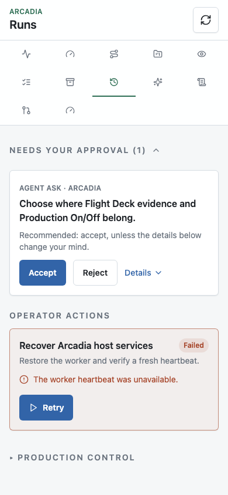

# Planning baseline QA

This PR prepares the information architecture and an inactive-Plan Ask. It
does not serve the proposed new routes or change the production dashboard.

Verified on the candidate based on `3d03d1d75`:

- `pnpm build` passed (generates the CLI/package output needed in a fresh worktree).
- `pnpm dashboard:build` passed.
- `pnpm exec vitest run apps/dashboard`: 17 files, 128 tests passed.
- `pnpm exec playwright test`: all 24 tests passed, including the existing push
  and Needs operator safety tests and two new baseline tests (5.1 minutes).
- The generated acceptance script passes Bash syntax and Python parsing;
  `--describe` returns its complete descriptor. Acceptance was not executed.

The [request inventory](baseline-requests.json) measures initial API calls in
an isolated fixture before polling. Runs: 2; Review: 1; Work Queue: 1; Flight
Deck: 2. After budgets in the proposal are targets, not measured results.
Neither request counts nor seeded data measure live Tailscale latency.

The screenshot is the current overloaded page, with fixture-only approval and
failed-script data. Reproduce with
`pnpm exec playwright test tests/e2e/runs-ia-baseline.spec.ts`.
The local fixture uses its allocated `http://127.0.0.1:<port>/runs`; the
corresponding existing phone URL is
`http://arcadia-1.alpine-rattlesnake.ts.net:3020/runs`.

Read-only live phone inspection also used these exact URLs:

- `http://arcadia-1.alpine-rattlesnake.ts.net:3020/review`
- `http://arcadia-1.alpine-rattlesnake.ts.net:3020/work-queue`
- `http://arcadia-1.alpine-rattlesnake.ts.net:3020/flight-deck`

Each build PR must add 390×844 screenshots of its new/changed pages, request
inventories, exact seeded URLs and intended phone URLs. Slice 3 includes
concurrent Sessions across Projects/Plans and separates Run completion from
Action acceptance. No live approvals, production toggles or scripts are QA
fixtures.
